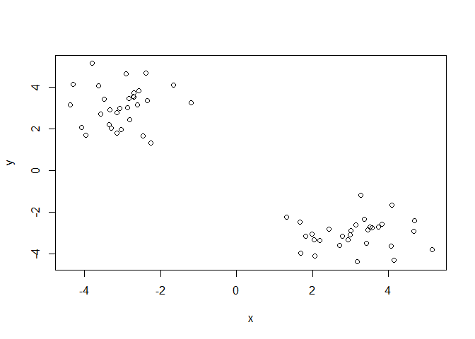
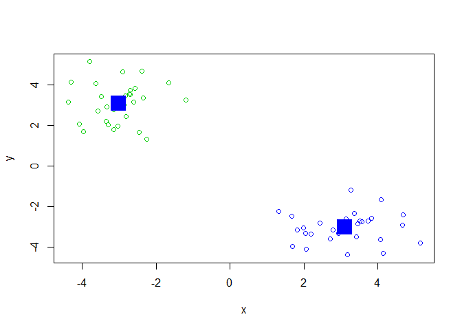
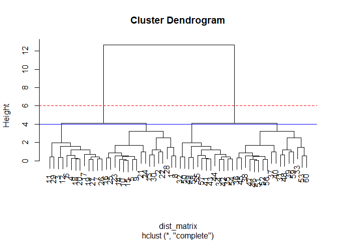
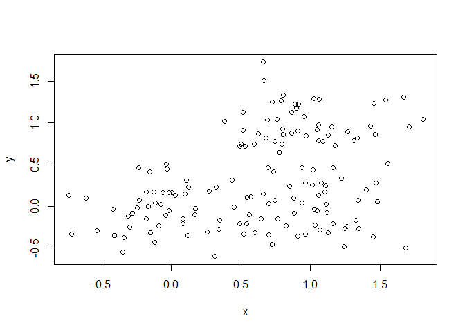
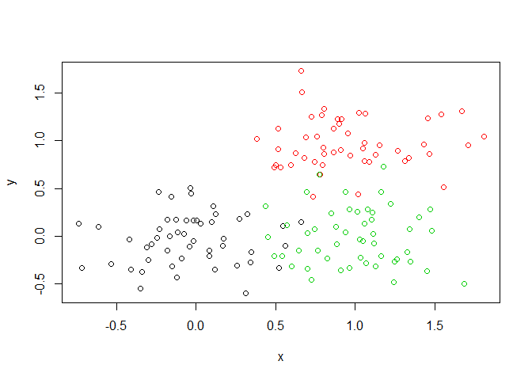
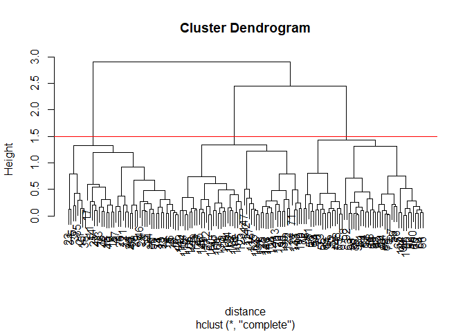
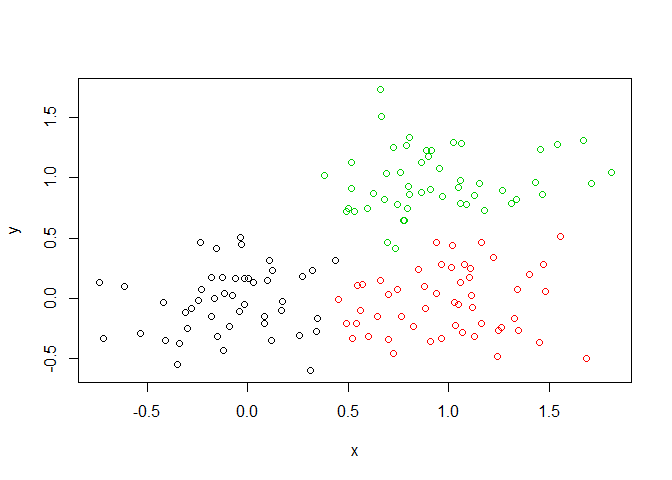
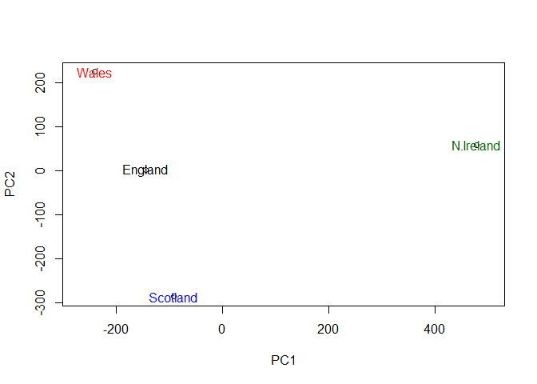

class09
================
Kendall Lin
2/4/2020

\#K-means clustering

``` r
# Generate some example data for clustering
#rnorm generates a set of random numbers around another number(normal distribution) -> in this case tmp is 30 values around -3 and then 3
#cbind combines into vector of x and y
tmp <- c(rnorm(30,-3), rnorm(30,3))
x <- cbind(x=tmp, y=rev(tmp))
plot(x)
```

<!-- -->

``` r
km<- kmeans(x, centers = 2, nstart = 20)
length(km$cluster)
```

    ## [1] 60

``` r
table(km$cluster)
```

    ## 
    ##  1  2 
    ## 30 30

Use the kmeans() function setting k to 2 and nstart=20

Inspect/print the results

Q. How many points are in each cluster? -\> 30 Q. What ‘component’ of
your result object details - cluster size? -\>
km\(size  - cluster assignment/membership? -> km\)cluster - cluster
center? -\> km$center

Plot x colored by the kmeans cluster assignment and add cluster centers
as blue points

``` r
#cluster is designated 1 or 2 so the color changes by the km$cluster value
plot(x, col = (km$cluster + 2))
points(km$centers, col = "blue", pch = 15, cex = 3)
```

<!-- -->

\#\#Hierarchical clustering in R

The main hierarchical clustering function in R is called `hclust()` An
important point here is that you have to calculate the distance matrix
deom your input data before calling `hclust()`

For this we will use the `dist()` function first.

``` r
# First we need to calculate point (dis)similarity
# as the Euclidean distance between observations
dist_matrix <- dist(x)
# The hclust() function returns a hierarchical
# clustering model
hc <- hclust(dist_matrix)
# the print method is not so useful here
hc 
```

    ## 
    ## Call:
    ## hclust(d = dist_matrix)
    ## 
    ## Cluster method   : complete 
    ## Distance         : euclidean 
    ## Number of objects: 60

We need to plot the hierarchical clustering graphically to visual the
results

``` r
plot(hc)
#A dendrogram is produced when plotting hclust() data -> tree shaped structure used to interpret -> the higher the tree structure, the further the distance to the next set

abline(h = 6, col = "red", lty = 2) #create a dashed red line at an argued height
abline(h= 4, col = "blue")
```

<!-- -->

To get cluster membership vector I need to “cut” the tree at a certain
height to yield my seperate cluster branches.

``` r
cutree(hc, h = 6) #cuts the tree at height h and outputs values into R console as a vector of values
```

    ##  [1] 1 1 1 1 1 1 1 1 1 1 1 1 1 1 1 1 1 1 1 1 1 1 1 1 1 1 1 1 1 1 2 2 2 2 2 2 2 2
    ## [39] 2 2 2 2 2 2 2 2 2 2 2 2 2 2 2 2 2 2 2 2 2 2

``` r
gp4 <- cutree(hc, k = 6) #k allows you to cut into 6 groups
table(gp4)
```

    ## gp4
    ##  1  2  3  4  5  6 
    ##  7 13 10  7 13 10

``` r
# Step 1. Generate some example data for clustering
x <- rbind(
 matrix(rnorm(100, mean=0, sd = 0.3), ncol = 2), # c1
 matrix(rnorm(100, mean = 1, sd = 0.3), ncol = 2), # c2
 matrix(c(rnorm(50, mean = 1, sd = 0.3), # c3
 rnorm(50, mean = 0, sd = 0.3)), ncol = 2))
colnames(x) <- c("x", "y")
# Step 2. Plot the data without clustering
plot(x)
```

<!-- -->

``` r
# Step 3. Generate colors for known clusters
# (just so we can compare to hclust results)
col <- as.factor( rep(c("c1","c2","c3"), each=50) )
plot(x, col=col)
```

<!-- --> Your Turn\!
Q. Use the dist(), hclust(), plot() and cutree() functions to return 2
and 3 clusters Q. How does this compare to your known ‘col’ groups?

``` r
distance <- dist(x)
hplot <- hclust(distance)
plot(hplot)
grps <- cutree(hplot, k = 3, h = 1.5)
abline(h = 1.5, col = "red")
```

<!-- -->

``` r
table(grps) #to get cluster membership vector use cutree() and then use table() to tabulate how many members in each cluster we have
```

    ## grps
    ##  1  2  3 
    ## 47 52 51

``` r
plot(x, col = grps) #notice that this graph looks similar to the one up above, but it is not identical -> there is no overlap of points in this graph b/c you are coloring by hclust data
```

<!-- -->

\#\#Dimensionality reduction and Principal Component Analysis -PC
seperates by “importance” as in the distance between PC1 will be more
significant than the distance between PC2 -PC captures variance

``` r
x <- read.csv("data/UK_foods.csv", row.names = 1)
dim(x) #dim() function returns number of cols and rows. To find row and col independently, you can use nrow() or ncol()
```

    ## [1] 17  4

``` r
head(x)
```

    ##                England Wales Scotland N.Ireland
    ## Cheese             105   103      103        66
    ## Carcass_meat       245   227      242       267
    ## Other_meat         685   803      750       586
    ## Fish               147   160      122        93
    ## Fats_and_oils      193   235      184       209
    ## Sugars             156   175      147       139

``` r
#make some plots
barplot(as.matrix(x), beside=T, col=rainbow(nrow(x)))
```

<!-- -->

``` r
barplot(as.matrix(x), beside=F, col=rainbow(nrow(x)))
```

<!-- -->

``` r
#pairs plot -> compares country vs country eg. left to right on top row is england vs england, england vs wales, england vs scotland, etc
pairs(x, col=rainbow(10), pch=16)
```

<!-- -->

Principal Component Analysis (PCA) `prcomp()` function

``` r
pca <- prcomp(t(x)) #t transposes data 
attributes(pca) #tells us what are the subgroups in pca (pca$_)
```

    ## $names
    ## [1] "sdev"     "rotation" "center"   "scale"    "x"       
    ## 
    ## $class
    ## [1] "prcomp"

``` r
summary(pca)
```

    ## Importance of components:
    ##                             PC1      PC2      PC3       PC4
    ## Standard deviation     324.1502 212.7478 73.87622 4.189e-14
    ## Proportion of Variance   0.6744   0.2905  0.03503 0.000e+00
    ## Cumulative Proportion    0.6744   0.9650  1.00000 1.000e+00

``` r
plot(pca$x[,1], pca$x[,2], xlab="PC1", ylab="PC2",
     xlim=c(-270,500))
text(pca$x[,1], pca$x[,2], colnames(x), col = c("black", "red", "blue", "darkgreen"))
```

<!-- -->
