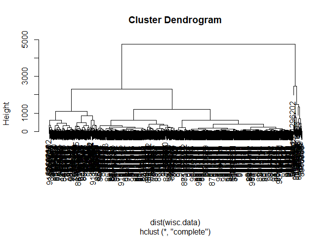
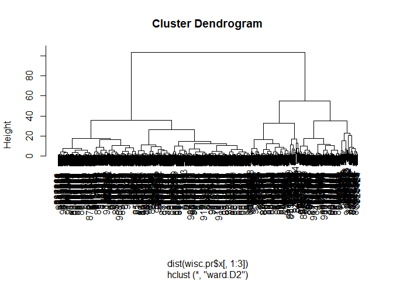
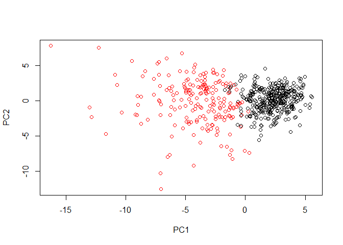
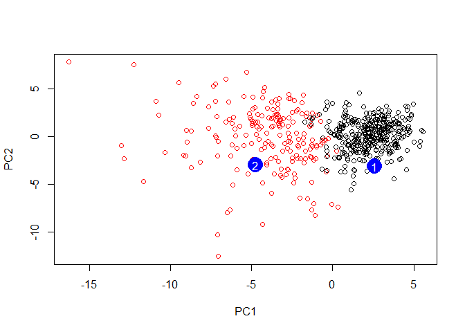

class10
================
Kendall Lin
2/6/2020

\#\#PCA issue -\> SCALING - the units measured will skew data because
largest numbers will be given highest priority - Can fix this issue by
using prcomp(x, scale = TRUE)

``` r
wisc.df <- read.csv("data/WisconsinCancer.csv")
#there are funky things in this dataset that we will ignore for our analysis, this includes the first and second ID and diagnosis columns and the last X column -> wand columns 3 to 32
wisc.data <- as.matrix(wisc.df[,3:32])
row.names(wisc.data) <- wisc.df$id

#How many patients do we have data for? 
nrow(wisc.data)
```

    ## [1] 569

``` r
#How many cancer/non-cancer?
table(wisc.df$diagnosis)
```

    ## 
    ##   B   M 
    ## 357 212

``` r
#How many variables/features in the data are suffixed with _mean?
grep("_mean", colnames(wisc.data), value = T) # value = T tells you what the matches are and Value = F tells where they are
```

    ##  [1] "radius_mean"            "texture_mean"           "perimeter_mean"        
    ##  [4] "area_mean"              "smoothness_mean"        "compactness_mean"      
    ##  [7] "concavity_mean"         "concave.points_mean"    "symmetry_mean"         
    ## [10] "fractal_dimension_mean"

``` r
grep("_mean", colnames(wisc.data))
```

    ##  [1]  1  2  3  4  5  6  7  8  9 10

``` r
#How do i print out the sum of grep instaed of the position?
length(grep("_mean", colnames(wisc.data)))
```

    ## [1] 10

\#\#Principal Component Analysis

Before we turn to PCA we need to think, or consider, whether we should
SCALE our input.

The input variables use different units of measurement.

  - The input variables have significantly different variances.
  - Check the mean and standard deviation of the features (i.e. columns)
    of the wisc.data to determine if the data should be scaled. Use the
    `colMeans()` and `apply()` functions like you’ve done before.

<!-- end list -->

``` r
round(apply(wisc.data, 2, sd), 2)
```

    ##             radius_mean            texture_mean          perimeter_mean 
    ##                    3.52                    4.30                   24.30 
    ##               area_mean         smoothness_mean        compactness_mean 
    ##                  351.91                    0.01                    0.05 
    ##          concavity_mean     concave.points_mean           symmetry_mean 
    ##                    0.08                    0.04                    0.03 
    ##  fractal_dimension_mean               radius_se              texture_se 
    ##                    0.01                    0.28                    0.55 
    ##            perimeter_se                 area_se           smoothness_se 
    ##                    2.02                   45.49                    0.00 
    ##          compactness_se            concavity_se       concave.points_se 
    ##                    0.02                    0.03                    0.01 
    ##             symmetry_se    fractal_dimension_se            radius_worst 
    ##                    0.01                    0.00                    4.83 
    ##           texture_worst         perimeter_worst              area_worst 
    ##                    6.15                   33.60                  569.36 
    ##        smoothness_worst       compactness_worst         concavity_worst 
    ##                    0.02                    0.16                    0.21 
    ##    concave.points_worst          symmetry_worst fractal_dimension_worst 
    ##                    0.07                    0.06                    0.02

``` r
as.matrix(colMeans(wisc.data))
```

    ##                                 [,1]
    ## radius_mean             1.412729e+01
    ## texture_mean            1.928965e+01
    ## perimeter_mean          9.196903e+01
    ## area_mean               6.548891e+02
    ## smoothness_mean         9.636028e-02
    ## compactness_mean        1.043410e-01
    ## concavity_mean          8.879932e-02
    ## concave.points_mean     4.891915e-02
    ## symmetry_mean           1.811619e-01
    ## fractal_dimension_mean  6.279761e-02
    ## radius_se               4.051721e-01
    ## texture_se              1.216853e+00
    ## perimeter_se            2.866059e+00
    ## area_se                 4.033708e+01
    ## smoothness_se           7.040979e-03
    ## compactness_se          2.547814e-02
    ## concavity_se            3.189372e-02
    ## concave.points_se       1.179614e-02
    ## symmetry_se             2.054230e-02
    ## fractal_dimension_se    3.794904e-03
    ## radius_worst            1.626919e+01
    ## texture_worst           2.567722e+01
    ## perimeter_worst         1.072612e+02
    ## area_worst              8.805831e+02
    ## smoothness_worst        1.323686e-01
    ## compactness_worst       2.542650e-01
    ## concavity_worst         2.721885e-01
    ## concave.points_worst    1.146062e-01
    ## symmetry_worst          2.900756e-01
    ## fractal_dimension_worst 8.394582e-02

Looks like we need to set scale = TRUE\!

``` r
# Perform PCA on wisc.data by completing the following code
wisc.pr <- prcomp(wisc.data, scale = T)
summary(wisc.pr)
```

    ## Importance of components:
    ##                           PC1    PC2     PC3     PC4     PC5     PC6     PC7
    ## Standard deviation     3.6444 2.3857 1.67867 1.40735 1.28403 1.09880 0.82172
    ## Proportion of Variance 0.4427 0.1897 0.09393 0.06602 0.05496 0.04025 0.02251
    ## Cumulative Proportion  0.4427 0.6324 0.72636 0.79239 0.84734 0.88759 0.91010
    ##                            PC8    PC9    PC10   PC11    PC12    PC13    PC14
    ## Standard deviation     0.69037 0.6457 0.59219 0.5421 0.51104 0.49128 0.39624
    ## Proportion of Variance 0.01589 0.0139 0.01169 0.0098 0.00871 0.00805 0.00523
    ## Cumulative Proportion  0.92598 0.9399 0.95157 0.9614 0.97007 0.97812 0.98335
    ##                           PC15    PC16    PC17    PC18    PC19    PC20   PC21
    ## Standard deviation     0.30681 0.28260 0.24372 0.22939 0.22244 0.17652 0.1731
    ## Proportion of Variance 0.00314 0.00266 0.00198 0.00175 0.00165 0.00104 0.0010
    ## Cumulative Proportion  0.98649 0.98915 0.99113 0.99288 0.99453 0.99557 0.9966
    ##                           PC22    PC23   PC24    PC25    PC26    PC27    PC28
    ## Standard deviation     0.16565 0.15602 0.1344 0.12442 0.09043 0.08307 0.03987
    ## Proportion of Variance 0.00091 0.00081 0.0006 0.00052 0.00027 0.00023 0.00005
    ## Cumulative Proportion  0.99749 0.99830 0.9989 0.99942 0.99969 0.99992 0.99997
    ##                           PC29    PC30
    ## Standard deviation     0.02736 0.01153
    ## Proportion of Variance 0.00002 0.00000
    ## Cumulative Proportion  1.00000 1.00000

Q. From your results, what proportion of the original variance is
captured by the first principal components (PC1)?

The 1st PC captures 44.27% of the original variance. Note that 72.6% is
captured in the first 3 PCs..

Lets make some figures…

``` r
biplot(wisc.pr)
```

<!-- --> That is a
hot mess\! We need to do our own PC1 vs PC2 plot and lets color by the
diagnosis

``` r
attributes(wisc.pr)
```

    ## $names
    ## [1] "sdev"     "rotation" "center"   "scale"    "x"       
    ## 
    ## $class
    ## [1] "prcomp"

``` r
# Scatter plot observations by components 1 and 2
diagnosis <- wisc.df$diagnosis
plot(wisc.pr$x[,1:2] , col = diagnosis, 
     xlab = "PC1", ylab = "PC2")
abline(h=0, col = "gray" , lty =2)
abline(v=0, col = "gray", lty = 2)
```

<!-- -->

``` r
# Repeat for components 1 and 3
plot(wisc.pr$x[,1], wisc.pr$x[,3],  col = diagnosis, 
     xlab = "PC1", ylab = "PC3")
```

<!-- -->

``` r
# Calculate variance of each component
pr.var <- wisc.pr$sdev^2
head(pr.var)
```

    ## [1] 13.281608  5.691355  2.817949  1.980640  1.648731  1.207357

``` r
# Variance explained by each principal component: pve
pve <- pr.var / sum(pr.var)

# Plot variance explained for each principal component
plot(pve, xlab = "Principal Component", 
     ylab = "Proportion of Variance Explained", 
     ylim = c(0, 1), type = "o")
```

<!-- -->

``` r
# Alternative scree plot of the same data, note data driven y-axis
barplot(pve, ylab = "Precent of Variance Explained",
     names.arg=paste0("PC",1:length(pve)), las=2, axes = FALSE)
axis(2, at=pve, labels=round(pve,2)*100 )
```

<!-- -->

``` r
## ggplot based graph
#install.packages("factoextra")
```

``` r
library(factoextra)
```

    ## Loading required package: ggplot2

    ## Welcome! Want to learn more? See two factoextra-related books at https://goo.gl/ve3WBa

``` r
fviz_eig(wisc.pr, addlabels = TRUE)
```

<!-- -->

Kmeans -\> Kmeans(x, centers = 2, nstart = 20) -\> hclust(c)

Hierarchical clustering of case data

Plotting with raw data -\> its a mess

``` r
plot(hclust(dist(wisc.data)))
```

<!-- -->

How about plot with scaling?

``` r
# Scale the wisc.data data: data.scaled
data.scaled <- scale(wisc.data)
data.dist <- dist(data.scaled)
wisc.hclust <- hclust(data.dist, "complete")
plot(wisc.hclust)
abline(h= 18, col="red", lty=2)
```

<!-- -->

Now with PCA data \#\#Clustering on PCA data Let’s see if PCA improves
or degrades the performance of hierarchical clustering.

Using the minimum number of principal components required to describe at
least 90% of the variability in the data, create a hierarchical
clustering model with the linkage method=“ward.D2”. We use Ward’s
criterion here because it is based on multidimensional variance like
principal components analysis. Assign the results to wisc.pr.hclust.

``` r
wisc.pr.hclust <- hclust(dist(wisc.pr$x[,1:3]), method = "ward.D2")
plot(wisc.pr.hclust)
```

<!-- -->

``` r
#use cutree() to figure out how many groups you want to cut the tree into -> you can cut at a height with h=_ or cut into a specified number of groups with k = _
grps <- cutree(wisc.pr.hclust, k=2)
table(grps)
```

    ## grps
    ##   1   2 
    ## 203 366

We can use the `table()` function to compare the $diagnosis vector with
out cluster results vector

``` r
table(grps, diagnosis)
```

    ##     diagnosis
    ## grps   B   M
    ##    1  24 179
    ##    2 333  33

``` r
plot(wisc.pr$x[,1:2], col=grps)
```

<!-- -->

``` r
g <- as.factor(grps)
levels(g)
```

    ## [1] "1" "2"

``` r
g <- relevel(g,2)
levels(g)
```

    ## [1] "2" "1"

``` r
plot(wisc.pr$x[,1:2], col=g)
```

<!-- -->

\#\#Prediction We will use the predict() function that will take our PCA
model from before and new cancer cell data and project that data onto
our PCA space.

``` r
#url <- "new_samples.csv"
url <- "https://tinyurl.com/new-samples-CSV"
new <- read.csv(url)
npc <- predict(wisc.pr, newdata=new)
npc
```

    ##            PC1       PC2        PC3        PC4       PC5        PC6        PC7
    ## [1,]  2.576616 -3.135913  1.3990492 -0.7631950  2.781648 -0.8150185 -0.3959098
    ## [2,] -4.754928 -3.009033 -0.1660946 -0.6052952 -1.140698 -1.2189945  0.8193031
    ##             PC8       PC9       PC10      PC11      PC12      PC13     PC14
    ## [1,] -0.2307350 0.1029569 -0.9272861 0.3411457  0.375921 0.1610764 1.187882
    ## [2,] -0.3307423 0.5281896 -0.4855301 0.7173233 -1.185917 0.5893856 0.303029
    ##           PC15       PC16        PC17        PC18        PC19       PC20
    ## [1,] 0.3216974 -0.1743616 -0.07875393 -0.11207028 -0.08802955 -0.2495216
    ## [2,] 0.1299153  0.1448061 -0.40509706  0.06565549  0.25591230 -0.4289500
    ##            PC21       PC22       PC23       PC24        PC25         PC26
    ## [1,]  0.1228233 0.09358453 0.08347651  0.1223396  0.02124121  0.078884581
    ## [2,] -0.1224776 0.01732146 0.06316631 -0.2338618 -0.20755948 -0.009833238
    ##              PC27        PC28         PC29         PC30
    ## [1,]  0.220199544 -0.02946023 -0.015620933  0.005269029
    ## [2,] -0.001134152  0.09638361  0.002795349 -0.019015820

``` r
plot(wisc.pr$x[,1:2], col=g)
points(npc[,1], npc[,2], col="blue", pch=16, cex=3)
text(npc[,1], npc[,2], c(1,2), col="white")
```

<!-- -->
