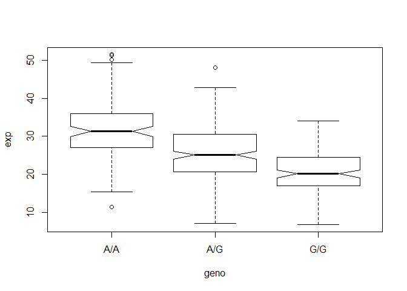

class15
================
Kendall Lin
2/25/2020

Galaxy user: kolin pass : kolin1

## Analyze RNA-seq by genotype results

Here we read the results of RNA-Seq for about \~230 samples(people) with
different genotypes for the rs8067378 Asthma associated SNP

``` r
expr <- read.table("rs8067378_ENSG00000172057.6.txt")
head(expr)
```

    ##    sample geno      exp
    ## 1 HG00367  A/G 28.96038
    ## 2 NA20768  A/G 20.24449
    ## 3 HG00361  A/A 31.32628
    ## 4 HG00135  A/A 34.11169
    ## 5 NA18870  G/G 18.25141
    ## 6 NA11993  A/A 32.89721

Extract the A/A rows

``` r
extractaa <- expr$geno == "A/A"
aalist<- expr[extractaa, ]
summary(aalist$exp)
```

    ##    Min. 1st Qu.  Median    Mean 3rd Qu.    Max. 
    ##   11.40   27.02   31.25   31.82   35.92   51.52

Extract the G/G rows

``` r
extractgg <- expr$geno == "G/G"
gglist<- expr[extractgg, ]
summary(gglist$exp)
```

    ##    Min. 1st Qu.  Median    Mean 3rd Qu.    Max. 
    ##   6.675  16.903  20.074  20.594  24.457  33.956

``` r
boxplot(exp ~geno, data = expr, notch = T)
```

<!-- -->
